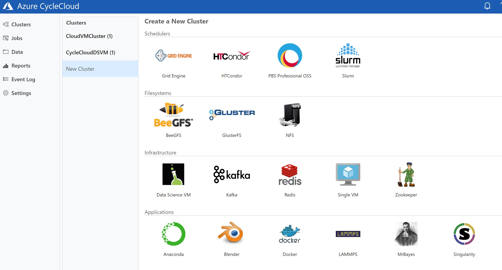
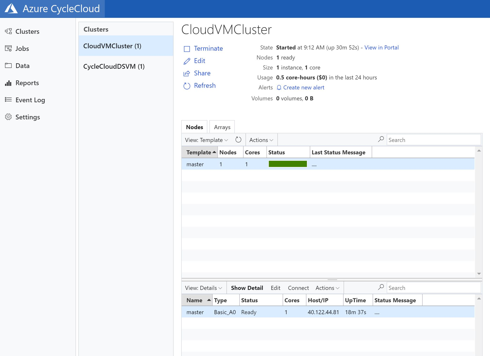

# Data Science Virtual Machine Deployment via Cycle CLoud 

This quick start demonstrates launching the Microsoft Azure Data Science VM with a single standalone node. 

The Data Science VM may be used as the base image in most CycleCloud clusters.

## Accepting the License for Azure MarketPlace Images

To use the Azure MarketPlace Images which require a license agreement approval such as the Microsoft DataScience VM, you must first accept the license agreement. The simplest way to do so is to run the following Azure CLI commands:

For Linux CentOS

```
az vm image accept-terms --publisher microsoft-ads --offer linux-data-science-vm --plan linuxdsvm
```

For Linux Ubuntu 

```
az vm image accept-terms --publisher microsoft-ads --offer linux-data-science-vm-ubuntu --plan linuxdsvmubuntu
```

For Windows 

```
az vm image accept-terms --publisher microsoft-ads --offer windows-data-science-vm --plan windows2016
```

## Pre-Requisites

CycleCloud must be installed and the head node running must be installed and running.

Ensure that the cycle server is running 

```
$ cd /opt/cycle_server
$ sudo ./cycle_server
```

- The CycleCloud CLI must be installed and configured for use.
- You must have access to log in to CycleCloud.
- You must have access to upload data and launch instances in your chosen Cloud Provider account.
- You must have access to a configured CycleCloud "Locker" for Project Storage (Cluster-Init and Chef).

## Using the Azure Cycle Cloud Portal

Login via https: to the URL of the Cycle Cloud Head Node





## Using Azure CLI 
Optional: To use the cyclecloud project upload <locker> command, you must have a Pogo configuration file set up with write-access to your locker.

a. You may use your preferred tool to interact with your storage "Locker" instead.


## Configuring the Project via CLI vs Cycle Cloud Head Node Portal

The first step is to configure the project for use with your storage locker:

- Open a terminal session with the CycleCloud CLI enabled.
- Switch to the data-science-vm project directory.

## Deploying the Project via CLI

To upload the project (including any local changes) to your target locker, run the cyclecloud project upload command from the project directory. The expected output looks like this:

```
$ cyclecloud project upload my_locker
Sync completed!
```

IMPORTANT

For the upload to succeed, you must have a valid Pogo configuration for your target Locker.

- Importing the Cluster Template

## To import the cluster:

Open a terminal session with the CycleCloud CLI enabled.

Switch to the data-science-vm project directory.

Run cyclecloud import_template Data-Science-VM -f templates/data-science-vm.txt. The expected output looks like this:

```
$ cyclecloud import_template Data-Science-VM -f templates/data-science-vm.txt --force
Importing template Data-Science-VM....
----------------------------
Data-Science-VM : *template*
----------------------------
Keypair:
Cluster nodes:
dsvm: off
Total nodes: 1
```
## Shutting Down your Cycle Compute Nodes

To shutdown the compute nodes from the Cycle Cloud Portal 

Select the VM Node and then select actions in the command windows




