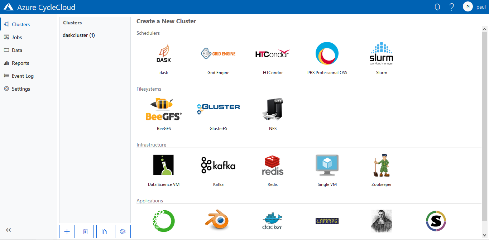

# Description

The `cyclecloud-dask` project provides a cluster application for [cyclecloud](https://azure.microsoft.com/en-us/features/azure-cyclecloud/) 
that installs and configures [dask](https://dask.org/) on the master and execution nodes.

# Installation

Clone the repository and upload the project to your storage:

    cyclecloud project upload azure-storage

where you need to replace `azure-storage` with your desired locker name.
Then you are ready to install it:

    cyclecloud import_template dask -c "DASK" -f templates/dask.txt 

Which should make it available in the clusters list.

If you want to remove it from the GUI execute:

    cyclecloud delete_template DASK
